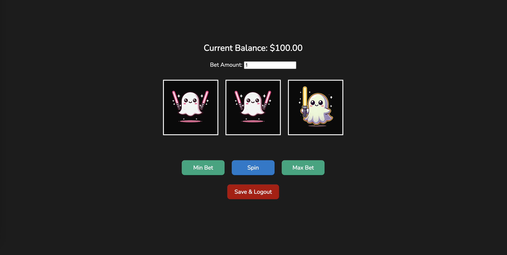

## Spooky Ghost Slot Machine

Welcome to my Spooky Ghost Slot Machine Game! This is a web-based slot machine game, where players spin the reels to try their luck and win big. Each player starts with $100 and can place bets on the outcome of the reels. Match ghost icons to win multipliers, and aim for the Jackpot Ghost to win 25x your bet!

This game was built to combine the thrill of gambling with a fun, spooky theme, ensuring a fun experience whether you're playing as a guest or with a saved account.

## Getting Started

You can play the game [here](https://josemdna.github.io/Spooky-Ghost-Slot-Machine-Game/).

### Instructions
1. Start by logging in, creating an account, or playing as a guest.
2. Use the input field to place your bet, and click the "Spin" button to start the game.
3. Match ghost icons to win multipliers based on the ghost type.
4. You can save your progress if logged in, or restart as a guest once your balance hits $0.

## Attributions

### Ghost Icon Images
- Blue Ghost: [Blue Ghost Image](https://i.imgur.com/lGNZkk8.png)
- Purple Ghost: [Purple Ghost](https://i.imgur.com/vA0Kydf.png)
- Green Ghost: [Green Ghost](https://i.imgur.com/D6s6SPB.png)
- Yellow Ghost: [Yellow Ghost](https://i.imgur.com/Q9p2XKx.png)
- Pink Ghost: [Pink Ghost](https://i.imgur.com/tBMFpbj.png)
- Jackpot Ghost: [Jackpot Ghost](https://i.imgur.com/2bgBQ73.png)

### Other Resources
- [Google Fonts - Nunito](https://fonts.google.com/specimen/Nunito)

## Technologies Used
- HTML
- CSS
- JavaScript 

## Next Steps
- Add a sound effect when the user clicks the spin button and when the user gets a win
- Add spinning reel animation
- Light/Dark mode 
- icons inside of reel get animated on a win

